# Developer Guide for Zer0Note

## Table Of Contents
[1. Introduction](#1-introduction-neil) <br>
&nbsp;&nbsp;[1.1. Welcome!](#11-welcome)<br>
&nbsp;&nbsp;[1.2. How to use this document](#12-how-to-use-this-document)<br>
[2. Setting up](#2-setting-up) <br>
&nbsp;&nbsp;[2.1. Prerequisites](#21-prerequisites) <br>
&nbsp;&nbsp;[2.2. Setting up the project in your computer](#22-setting-up-the-project-in-your-computer) <br>
&nbsp;&nbsp;[2.3. Verifying the setup](#23-verifying-the-setup) <br>
&nbsp;&nbsp;[2.4. Configure coding style](#24-configure-the-coding-style) <br>
[3. Design](#3-design) <br>
&nbsp;&nbsp;[3.1. Architecture](#31-architecture-neil) <br>
&nbsp;&nbsp;[3.2. UI Component](#32-ui-component-neil) <br>
&nbsp;&nbsp;[3.3. Commands Component](#33-commands-component-neil) <br>
&nbsp;&nbsp;[3.4. Tasks Component](#34-tasks-component) <br>
&nbsp;&nbsp;[3.5. Notebooks Component](#35-notebooks-component)<br>
&nbsp;&nbsp;[3.6. Storage Component](#36-storage-component)<br>
[4. Implementation](#4-implementation) <br>
&nbsp;&nbsp;[4.1. Mode Switch Feature](#41-mode-switch-feature) <br>
&nbsp;&nbsp;[4.2. Timetable Mode](#42-timetable-mode) <br>
&nbsp;&nbsp;&nbsp;&nbsp;[4.2.1. Tasklist Management Feature](#421-tasklist-management-feature) <br>
&nbsp;&nbsp;&nbsp;&nbsp;[4.2.2. Mark as done Feature](#422-mark-as-done-feature) <br>
&nbsp;&nbsp;&nbsp;&nbsp;[4.2.3. Tag Feature](#423-tag-feature) <br>
&nbsp;&nbsp;&nbsp;&nbsp;[4.2.4. List Feature](#424-list-feature) <br>
&nbsp;&nbsp;&nbsp;&nbsp;[4.2.5. Search Feature](#425-search-feature) <br>
&nbsp;&nbsp;[4.3. Notebook Mode](#43-notebook-mode) <br>
&nbsp;&nbsp;&nbsp;&nbsp;[4.3.1. Notebook Management Feature](#431-notebook-management-feature) <br>
&nbsp;&nbsp;&nbsp;&nbsp;[4.3.2. Select Feature](#432-select-feature) <br>
&nbsp;&nbsp;&nbsp;&nbsp;[4.3.3. Tag Feature](#433-tag-feature) <br>
&nbsp;&nbsp;&nbsp;&nbsp;[4.3.4. Search Feature](#434-search-feature) <br>
&nbsp;&nbsp;[4.4. Storage](#44-storage-neil) <br>
&nbsp;&nbsp;&nbsp;&nbsp;[4.4.1. Storage Format](#441-storage-format) <br>
&nbsp;&nbsp;&nbsp;&nbsp;&nbsp;&nbsp;[4.4.1.1. TaskList](#4411-tasklist) <br>
&nbsp;&nbsp;&nbsp;&nbsp;&nbsp;&nbsp;[4.4.1.2. Page](#4412-page) <br>
&nbsp;&nbsp;&nbsp;&nbsp;&nbsp;&nbsp;[4.4.1.3. Section](#4413-section) <br>
&nbsp;&nbsp;&nbsp;&nbsp;&nbsp;&nbsp;[4.4.1.4. Notebook](#4414-notebook) <br>
&nbsp;&nbsp;&nbsp;&nbsp;&nbsp;&nbsp;[4.4.1.5. NotebookShelf](#4415-notebookshelf) <br>
&nbsp;&nbsp;&nbsp;&nbsp;[4.4.2. Implementation](#442-implementation) <br>
&nbsp;&nbsp;&nbsp;&nbsp;&nbsp;&nbsp;[4.4.2.1. Saving the application state](#4421-saving-the-application-state) <br>
&nbsp;&nbsp;&nbsp;&nbsp;&nbsp;&nbsp;[4.4.2.2. Reading the application state](#4422-reading-the-application-state) <br>
&nbsp;&nbsp;[4.5. Error handling](#45-error-handling) <br>
&nbsp;&nbsp;[4.6. Personalised Messages](#46-personalised-messages) <br>
[5. Documentation](#5-documentation) <br>
&nbsp;&nbsp;[5.1. Setting up and maintaining the project website](#51-setting-up-and-maintaining-the-project-website) <br>
&nbsp;&nbsp;[5.2. Style guidance](#52-style-guidance) <br>
&nbsp;&nbsp;[5.3. Diagrams](#53-diagrams) <br>
&nbsp;&nbsp;[5.4. Converting a document to the PDF Format](#54-converting-a-document-to-the-pdf-format) <br>
[6. Testing](#6-testing) <br>
&nbsp;&nbsp;[6.1. Running tests](#61-running-tests) <br>
&nbsp;&nbsp;[6.2. Types of tests](#62-types-of-tests) <br>
[Appendix A: Project Scope](#appendix-a-project-scope) <br>
[Appendix B: User Stores](#appendix-b-user-stories) <br>
[Appendix C: Use Cases](#appendix-c-use-cases) <br>
[Appendix D: Non-Functional Requirements](#appendix-d-non-functional-requirements) <br>
[Appendix E: Glossary](#appendix-e-glossary) <br>
[Appendix F: Instructions for manual testing](#appendix-f-instructions-for-manual-testing) <br>

<hr>
<hr>

<!-- @@author neilbaner -->

## 1. Introduction (Neil)

### 1.1. Welcome!
Welcome, and thank you for choosing to help contribute to Zer0Note! Zer0Note is a command-line based note-taking and
organisation application. It is designed to combine the features of graphical tools like OneNote and Notion, with
the editing speed of applications like vim and emacs.

This document is written for developers intending to improve Zer0Note, by fixing bugs, or perhaps adding entirely new
features. It explains how the project is set up, the architecture used, and the code style you should adopt when
contributing code to the project.

### 1.2. How to use this document

#### 1.2.1. Keywords

`Text that looks like this denotes a keyword or small extract of code.`

Example: The `CliUserInterface` is used to handle input and output to and from the console.

#### 1.2.2. Code blocks

```
    Text that looks like this denotes a larger extract of code.
```

Example:
```java
    System.out.println("This is a code block!");
```

#### 1.2.3. UI elements

**`Text that looks like this denotes a button, or other UI element you may see on screen. `**

Example: Click **`Configure`** > **`Project Defaults`** > **`Project Structure`**

#### 1.2.4. Tips

> Text that looks like this indicates a tip, providing additional information that is useful but not critically
> important

Example:

> We use this method because Chrome's built-in PDF viewer preserves hyperlinks.

#### 1.2.5. Important information

> :exclamation: Text that looks like this, beginning with the :exclamation: sign indicates information that is very
> important, such as warnings about potential mistakes or common problems

Example:

> :exclamation: **Caution** Follow the steps in the following guide precisely.

<br>
<hr>
<hr>

## 2. Setting up

The following section describes how to set up the coding environment on your own computer, in order to start writing
code to improve Zer0Note.

### 2.1. Prerequisites

1. **JDK** 11
2. **IntelliJ** IDEA

### 2.2. Setting up the project in your computer

>:exclamation: Follow the steps in the following guide precisely. Things will not work out if you deviate in some steps.

1. **Fork** this repo, and **clone** the fork into your computer.
2. Open IntelliJ (if you are not in the welcome screen, click **`File`** > **`Close Project`** to close the existing project dialog first).
3. Set up the correct JDK version for Gradle  
   a. Click **`Configure`** > **`Project Defaults`** > **`Project Structure`**  
   b. Click **`New...`** and find the directory of the JDK.
4. Click **`Import Project`**.
5. Locate the **`build.gradle`** file and select it. Click **`OK`**.
6. Click **`Open as Project`**.
7. Click **`OK`** to accept the default settings.

### 2.3. Verifying the setup

1. Run the `teetwelvedashthree.zeronote.Duke`.
2. Try a few commands.
3. [Run the tests](#61-running-tests) to ensure they all pass.

### 2.4. Configure the coding style

If using IDEA, follow the guide [[se-edu/guides] IDEA: Configuring the code style](https://se-education.org/guides/tutorials/intellijCodeStyle.html)
to set up IDEA’s coding style to match ours.

>Optionally, you can follow the guide [[se-edu/guides] Using Checkstyle](https://se-education.org/guides/tutorials/checkstyle.html)
>to find how to use the CheckStyle within IDEA e.g., to report problems as you write code.

<br>
<hr>
<hr>

<!-- @@author neilbaner -->

## 3. Design

The following section describes the design and implementation of the product. UML diagrams and code snippets are used
to explain some aspects of the code. If you are unfamiliar with UML, the diagrams should still be fairly
understandable. However, you may wish to consult [[CS2113/T] Modeling](https://nus-cs2113-ay2021s1.github.io/website/se-book-adapted/chapters/modeling.html) for a quick introduction to UML.

### 3.1 Architecture (Neil)

**How the architecture components interact with each other**

The following diagram provides a rough overview of how **Zer0Note** is built.

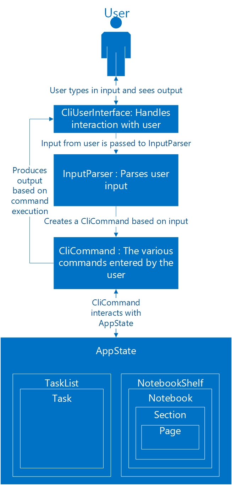
Figure [1]. Architecture of the application

The `CliUserInteface` (see [here](#32-ui-component-neil)) is the "highest" layer of the application, in
the sense that it interacts directly with the user, and it passes along the input to other classes. The
`CliUserInterface` contains the state of the application, stored in an instance of `AppState`. It then uses the other
classes such as `InputParser` and the various `CliCommand` classes to execute the instructions provided by the user
. This is explained in more detail in the following sections.

### 3.2 UI Component (Neil)

The user interface of **Zer0Note** is provided by the class `CliUserInterface`. It is instantiated once in the main
method, and its `run()` method is called to start the UI for the application.


The `CliUserInterface` class contains an instance of `AppState`. This is a class that, as the name implies, contains
the current state of the running instance of the application. For example, it contains the user data, the current mode,
the navigation state (i.e. currently chosen notebook/section/page).


The process below describes the operation of the `run()` method in `CliUserInterface`:
* The method `loadState()` is called, which loads the save file, and populates the `AppState` object with the
previously saved user data.
* The `startUI()` method is called to display the welcome message to the user.
* The `CliUserInterface` class then continuously gets the input from the user. It then uses the `InputParser` class to
parse this input and creates a new `CliCommand` object based on the command entered by the user. It executes the
command with `CliCommand.execute()` (learn more [here](#33-commands-component-neil)), which will use or modify the
`AppState` instance to make the requested change.
* If any of these steps encounters an error, an exception of the type `ZeroNoteException` is thrown by the method, and
caught in the `run()` method. Upon catching an exception, the `printErrorMessage()` method is called to display the
appropriate error message to the usaer. See [here]() for more information on how exceptions work in **Zer0Note**.

### 3.3. Commands Component (Neil)

Every command that a user can input into **Zer0Note** is represented by an object that extends the abstract class
`CliCommand`. `CliCommand` contains some basic fields and methods that are shared by all types of commands, such as:

* `execute()`, which is called after setting up the object appropriately, to perform the action requested by the user;

* `appState`, which refers to the `AppState` object that stores the state of the currently running instance of
**Zer0Note**; and

* `commandParams`, which is a String containing the parameters the user entered as parameters to the command.

The following 2 UML diagrams show the different types of `CliCommand` components used in the application.

This diagram describes the `CliCommand`s related to the Timetable mode.

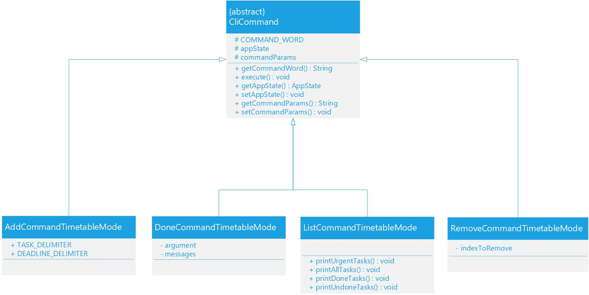
Figure [2]. Class diagram for Timetable commands

And this diagram describes the `CliCommand`s related to the Notebook mode.

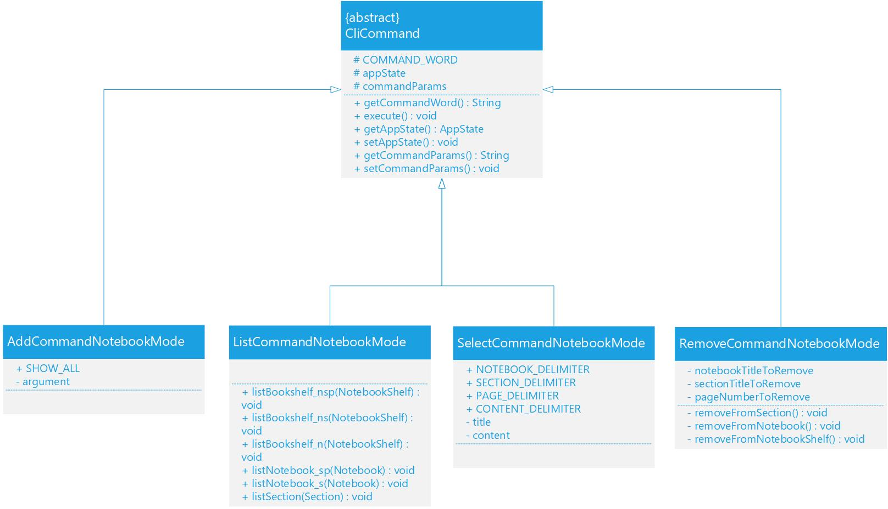
Figure [3]. Class diagram for Notebook commands

### 3.4. Tasks Component


Figure [4]. Class diagram for the Task component

The `Tasks` component,

- stores an array of `Task` objects that represents the deadline of the user.
- together with the `Notebooks` component form the `AppState` component.   

The `TaskList` class,

- has methods `TaskList#addTask()` to add a new `Task` object and `TaskList#removeTask()` to remove an existing one at 
an index.

### 3.5. Notebooks Component


Figure [5]. Class diagram for the Notebooks component

The `Notebooks` class,

- stores a `NotebookShelf` object that contains a list of `Notebook` objects.
- together with the `Tasks` component form the `AppState` component.

The `NotebookShelf` class,

- has methods `NotebookShelf#addNotebook()` to add new `Notebook` object and `NotebookShelf#removeNotebook()` remove an 
existing one.
- has methods `NotebookShelf#findNotebook()` to search through to find a `Notebook` object with matching titles.

The `Notebook` class,

- contains a title and a list of `Section` objects.
- has methods `Notebook#addSection()` to add a new `Section` and `Notebook#removeSection()` to remove an existing one.
- has a `tag` field that user can be set and get.

The `Section` object,

- contains a title and list of `Page` objects.
- has methods `Section#addPage()` to add a new `Page` object and `Section#removePage()` to remove an existing one.
- has a `tag` field that user can be set and get.

The `Page` object,

- contains a title, and the content of the page as a String object.
- has a `tag` field that user can be set and get.

<!-- @@author yAOwzers-->

### 3.6. Storage Component


Figure [6]. Class diagram for the Storage component

The `Storage` component,

- Stores user's inputs into .txt files, which are all found under the same `data` directory.  

- Contains the method `saveToFile` to save the current AppState of the application in the `notebooks.txt` and `tasks.txt` files.  

- Contains the method `readFromFile` to load up data containing the input of the user's previous session on Zer0Note.  

- Saves the name of the user in a `nameOfUser.txt` and reads it back in the form of personalised messages.   

<br>
<hr>
<hr>

## 4. Implementation

The following section describes the implementation of certain key features in the current version of Zer0Note. It also
provides some background into our (the original developers of Zer0Note) thinking and the rationale behind the
decisions.

### 4.1. Mode Switch Feature

#### 4.1.1. Implementation

The mode switch mechanism is facilitated by `AppState`. It contains an `AppMode` object and can be accessed from
`Mode Switch` object. The `AppMode` is a enum which have five possible values: `TIMETABLE`, `NOTEBOOK_SHELF`, `NOTEBOOK_BOOK`,
`NOTEBOOK_SECTION`, `NOTEBOOK_PAGE`. Users can only use the `mode` command to switch to either TIMETABLE or NOTEBOOK_SHELF 
modes. The rest of the modes are used by developers when implementing the `select` command.

The following sequence diagram shows how the mode switch operation works:

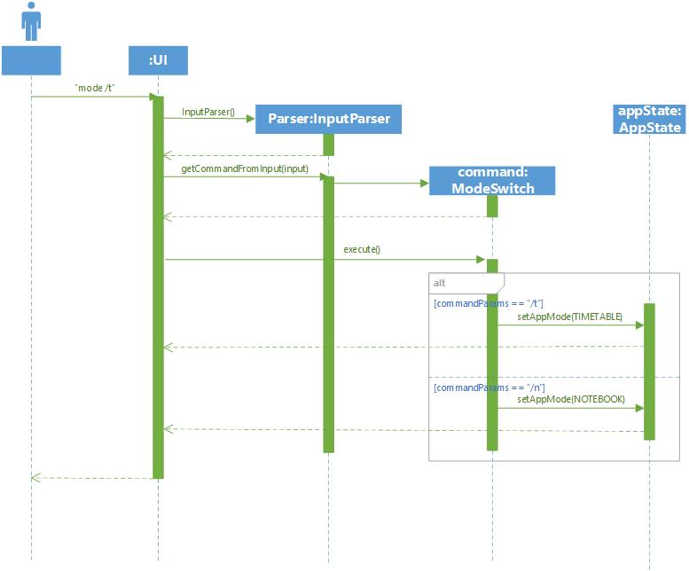
Figure [7]. Sequence diagram for the Mode Switch Command

Given below is an example usage scenario and how the find mode switch function behaves.

Step 1. The user launches the application for the first time. The `AppState` object is constructed and the `AppMode`
field is set to `TIMETABLE` by default.

Step 2. The user types `mode /n`. The `mode /t` command is passed through
`InputParser#getCommandFromInput`, which constructs a `ModeSwitch` object and calls `ModeSwitch#execute()`.

Step 3. `execute()` is called, which then set the `AppMode` field in the `AppState` object either to `TIMETABLE`
or `NOTEBOOK_SHELF` or throw an `InvalidCommandException`.

Step 4. To signal that the user has successfully changed the mode, a message is printed with the current mode of the
program.  

### 4.2. Timetable Mode

#### 4.2.1. TaskList Management Feature

**Implementation**

`TaskList` is implemented to manage and store the tasks input by the user. It comprises an `ArrayList` list of
 `Task`s, and a few helper methods.

This means that multiple operations such as addition and deletion can be done on a `Task`, without affecting
the contents of other `Task` in the `TaskList`.
<br>

Given below is an example usage scenario and how the add task function behaves.

1. The user launches the application for the first time. CliUserInterface#executeCommand is called when the user adds a `Task` into the `TaskList`.

2. The user types `add /tTask /by19-10-2020 1900`. The `add` command is passed through `InputParser#getCommandFromInput`, which then creates a constructor for `AddCommandTimetableMode`.

3. `AddCommandTimetableMode#execute()` is called, which then calls `InputParser#parseTaskTitle`, which first extracts the `title` from the user's input.

4. `InputParser#parseDeadline` is then called, which returns the `deadline` to `AddCommandTimetableMode#execute()`.

5. `TaskList#addTask` is then called and a new `Task`, with `title` and `deadline`, is initialised.

6. To signal that the user has successfully added a task, a message is printed with `CliMessages#printAddedTaskMessage`.

The UML sequence diagram below shows how the add task command works.
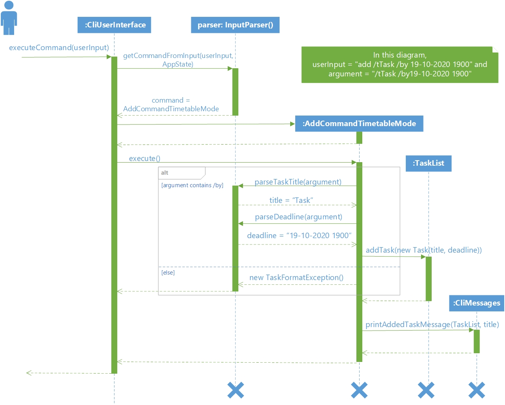
Figure [8]. Sequence diagram for the Add Task Command

<hr>
TaskList also allows the deletion of tasks by the user.

The figure below shows how the delete task command works:
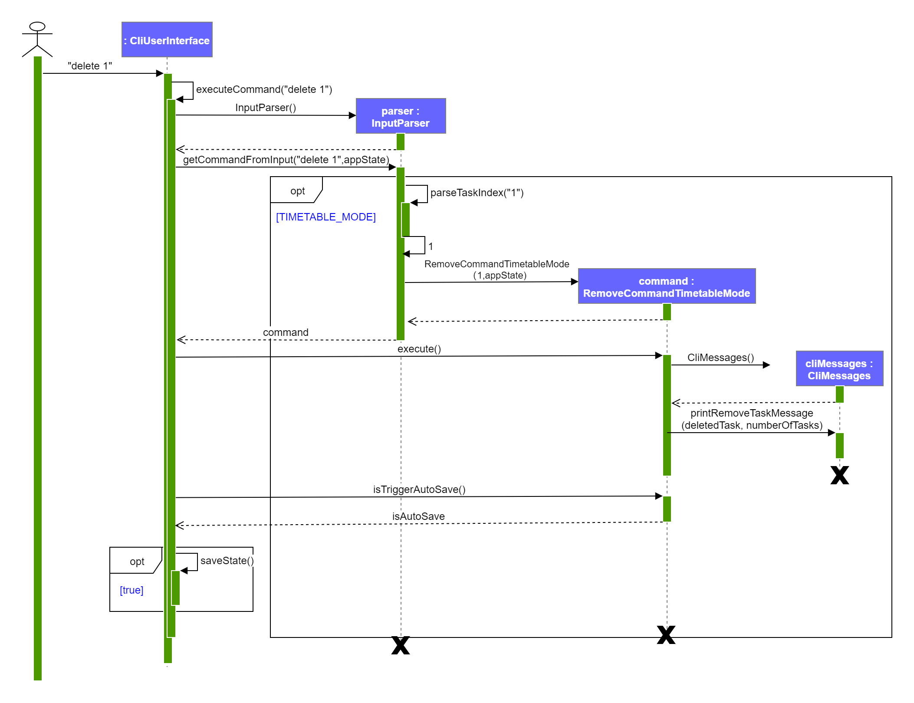
Figure [9]. Sequence diagram for the Delete Task Command

Here are the general steps that the command goes through when the user inputs "delete 1":
1. The `CliUserInterface` receives the "delete 1" input by the user and passes it to the `InputParser` class.
2. `InputParser` parses the input to determine the type of command and the index of the task that is required to delete.
3. `InputParser` constructs a `RemoveCommandTimetableMode` and passes the index number to the class.
4. `RemoveCommandTimetableMode#execute()` is called to delete the task.
5. If the task is deleted, `RemoveCommandTimetableMode#execute()` also calls `CliMessages#printRemoveTaskMessage` to
display the success message to the user.
6. `CliUserInterface#IsTriggerAutosave` is called to verify whether a change has been made in the TaskList or
NotebookShelf.

**Design Considerations**

*Aspect: How to store tasks in `TaskList`*
- **Alternative 1 (current choice):** Store as an `ArrayList` of tasks
    - Pros: It is easier to implement because the code base are list based.
    - Cons: It is unoptimized in terms of complexity, which requires more work for scaling of the application.
- **Alternative 2:** Store as a Hash Table with the key as the index and value as `Task`
    - Pros: It has a better time complexity and reduce the work in scaling stage since this data structure is more optimized (O(1) can be achieved).
    - Cons: It takes more resources to implement. The constant factor for a hashing algorithm is significant and not
     worth the tradeoff for smaller amounts of data, like a typical user would be likely to generate.

<!-- @@author yAOwzers-->

#### 4.2.2. Mark as done feature  

**Implementation**  

The `Task` class contains a member `isDone` of Boolean type.

The following sequence diagram shows how the mark as done operation works:  

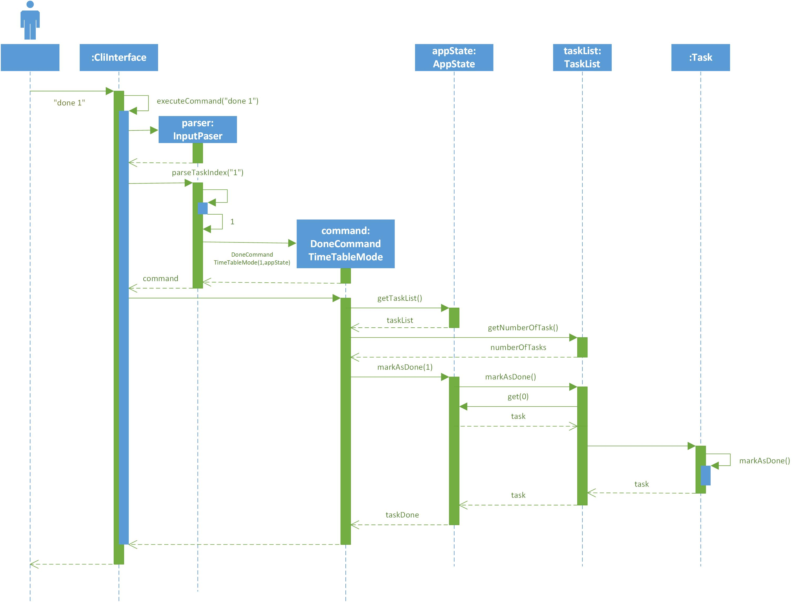
Figure [10]. Sequence diagram for Mark as Done Command

The following is an example of the processes that occur when the user uses the mark as done function:  

1. The user types `done 1`. The `done 1` command is passed through `InputParser#getCommandFromInput`, which constructs a DoneCommandTimetableMode object and calls `DoneCommandTimetable#execute()`.  

2. `execute()` is called, which then initialises a variable `taskList` of type TaskList. The method then calls `AppState#getTaskList`, which returns all exisiting tasks in the current tasklist.  

3. The `execute()` method proceeds to parse the user's intended task index to be marked as done through `Integer.parseInt()`. Using this index, it initialises a variable `taskDone` of type task and calls `AppState#markAsDone(index)`.  
        
4. `Appstate#markAsDone(index)` calls the `isDone()` method in task, which changes the isDone variable in the specific task to be true.  

5. After `taskDone` is initialised, a `CliMessages` object of name `messages` calls a method `printMarkDone(taskDone)` with the variable `taskDone` as the argument, which in turn prints a success message with the respective task to the user.   

#### 4.2.3. Tag Feature
The user can tag `Task`s in the `TaskList`. This section describes the implementation and design considerations for this
feature.

**Implementation**
The `Task` class contains a member `tag` of String type.

The figure below shows how the tag operation works:

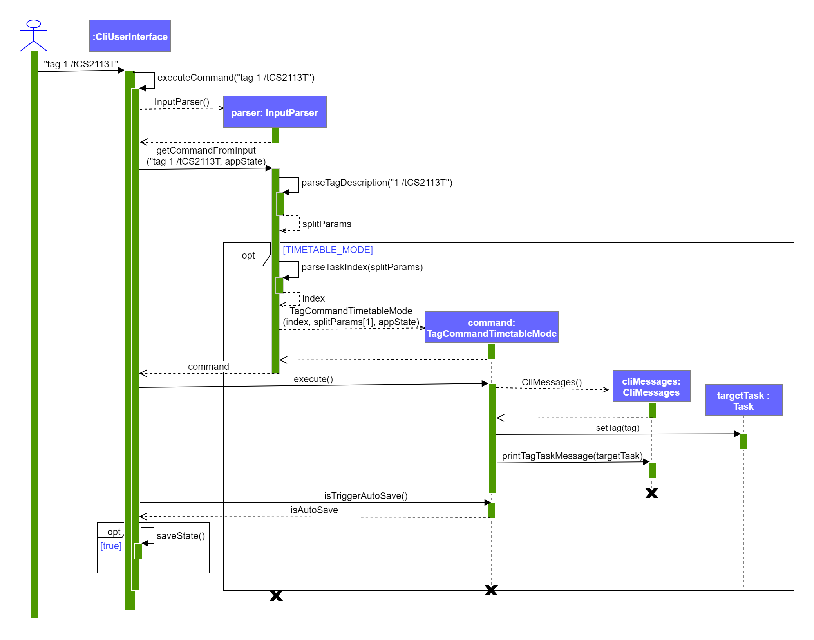
Figure [11]. Sequence diagram for Tag Timetable Command

There are the general steps during the tag operation. When the user enters `tag 1 /tCS2113T` into the command window
while using the application:
1. The `CliUserInterface` receives the "tag 1 /tCS2113T" input by the user and passes it to the `InputParser` class.
2. `InputParser#getCommandFromInput` parses the input to get the task index number and the tag description
3. `InputParser#getCommandFromInput` then constructs the `TagCommandTimetableMode` class and returns it to
`CliUserInterface`.
4. `TagCommandTimetableMode#execute()` is called to tag the task.
5. If the tag is added successfully, `TagCommandTimetableMode#execute()` calls `CliMessages#printTagTaskMessage` to
display the success message to the user.
6. `CliUserInterface#IsTriggerAutosave` is called to verify whether a change has been made in the TaskList or
NotebookShelf.

**Design Considerations**
This section describes some of the considerations involved when designing the tag feature.

*Aspect: How to store the tags*
- **Alternative 1 (current choice):** Store as a private `String` member in every task
    - Pros: It is easy to access for print operations.
    - Cons: It is unoptimized in terms of complexity for search operations, which requires more work for scaling of the
    application.
- **Alternative 2:** Store as a Hash Table with the key as the tag and value as `Task`
    - Pros: It has a better time complexity for search operations since this data structure is more optimized (O(1) can
    be achieved).
    - Cons: It is hard to retrieve the tag for a specific `Task` due to the structure of the key-value pair.

#### 4.2.4. List Feature

**Implementation**

The following sequence diagram shows how the list operation works:

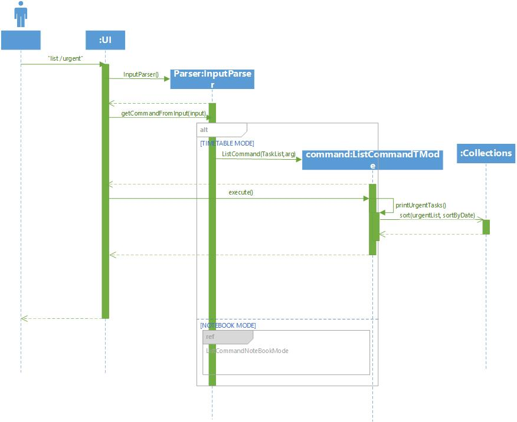
Figure [12]. Sequence diagram for List Command in Timetable Mode

Given below is an example usage scenario and how the list function behaves.

Step 1. The user types `list /urgent`. The `list /urgent` command is passed through
`InputParser#getCommandFromInput`, which constructs a `ListCommandTimetableMode` object and calls
`ListCommandTimetableMode#execute()`.

Step 2. `execute()` is called, which then calls the `sort()` function of `Collections` utility class and sort the list
based on the due date of the `Task` objects in the list.

Step 3. The program prints up to three tasks in the sorted list.

#### 4.2.5. Search Feature
This feature allows the user to search for tasks by keyword or by tag. Refer to [Tag Feature](#423-tag-feature) for more
 information on the implementation of tags.

This section explains the implementation and design considerations for the search feature.

**Implementation**

The class `FindCommandTimetableMode` executes the search feature. The following sequence diagram shows an example of
how the complete command works:

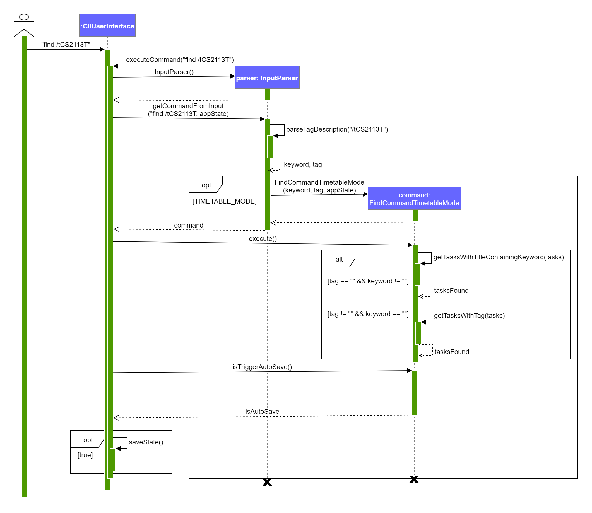
Figure [13]. Sequence diagram for Find Command in Timetable Mode

For example, when the user enters `find /tCS2113T` into the command window while using the application:
1. The `CliUserInterface` receives the "find /tCS2113T" input by the user and passes it to the `InputParser` class.
2. `InputParser#getCommandFromInput` parses the input to return an empty keyword and the tag description.
3. `InputParser#getCommandFromInput` then constructs the `FindCommandTimetableMode` class and returns it to
`CliUserInterface`.
4. `FindCommandTimetableMode#execute()` is called to conduct the search.
    a. If tag is empty, `execute()` calls `getTasksWithTitleContainingKeyword(tasks)`, which returns all tasks which
    contain the keyword in their title.
    b. If keyword is empty, `execute()` calls `getTasksWithTag(tasks)`, which returns all tasks with the tag.
5. If the tag is added successfully, `TagCommandTimetableMode#execute()` displays all found tasks to the user.
6. `CliUserInterface#IsTriggerAutosave` is called to verify whether a change has been made in the TaskList or
NotebookShelf.

**Design Considerations**

This section describes some considerations involved when designing the find feature.

*Aspect: Distinction between finding by keyword and finding by tag*
- **Alternative 1 (current choice):** Handle as a if-else statement in a single class
- **Alternative 2:** Two different classes that are subclasses to a class `FindCommandTimetableMode`
    - Pros: Higher level of abstraction
    - Cons: Unable to be returned directly by `InputParser#getCommandFromInput` as they are not subclasses of the
    `CliCommand` class. An if-else statement is still required inside the`FindCommandTimetableMode#execute` method.

### 4.3. Notebook Mode

#### 4.3.1. Notebook Management Feature

As shown in Figure 1, the `NotebookShelf` class comprises instances of `Notebook` class. `Notebook` comprises `Section`
and `Section` comprises `Page`. The navigability is not bidirectional. Multiple operations such as addition and deletion
can be done without affecting other instances at all, while updating the `Notebook` it is in.

This section explains the implementation and design considerations for managing `Notebook`s.

**Implementation**
There are two main functions in notebook management: add and remove.
<br>

Given below is an example usage scenario and how the add notebook function behaves.

1. The user launches the application for the first time. `CliUserInterface#executeCommand` is called when the user adds new `Notebook` into the `NotebookShelf`.

2. The user types `add /nCS2113T`. The `add` command is passed through `InputParser#getCommandFromInput`.

3. `InputParser#parseNotebookTitle` is then called, and it returns the `titleToAdd`, which is `CS2113T`.

4. A constructor for `AddCommandNotebookMode` is created.

5. `AddCommandNotebookMode#execute()` runs, which then calls `NotebookShelf#addNotebook`.

6. A new `Notebook`, entitled `CS2113T` is initialised.

The UML sequence diagram below shows how the add notebook command works.
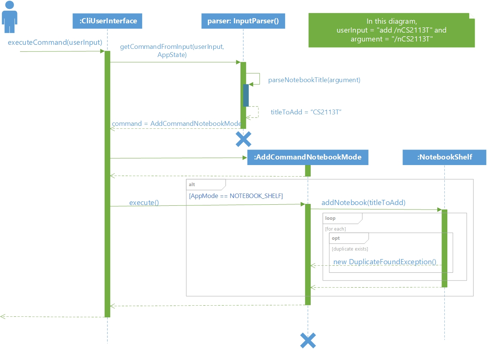
Figure [14]. Sequence diagram for Add Command in Notebook Mode

<hr>
Notebook Mode also allows the user to remove a notebook/section/page.

The figure below shows how the "delete notebook" command works:
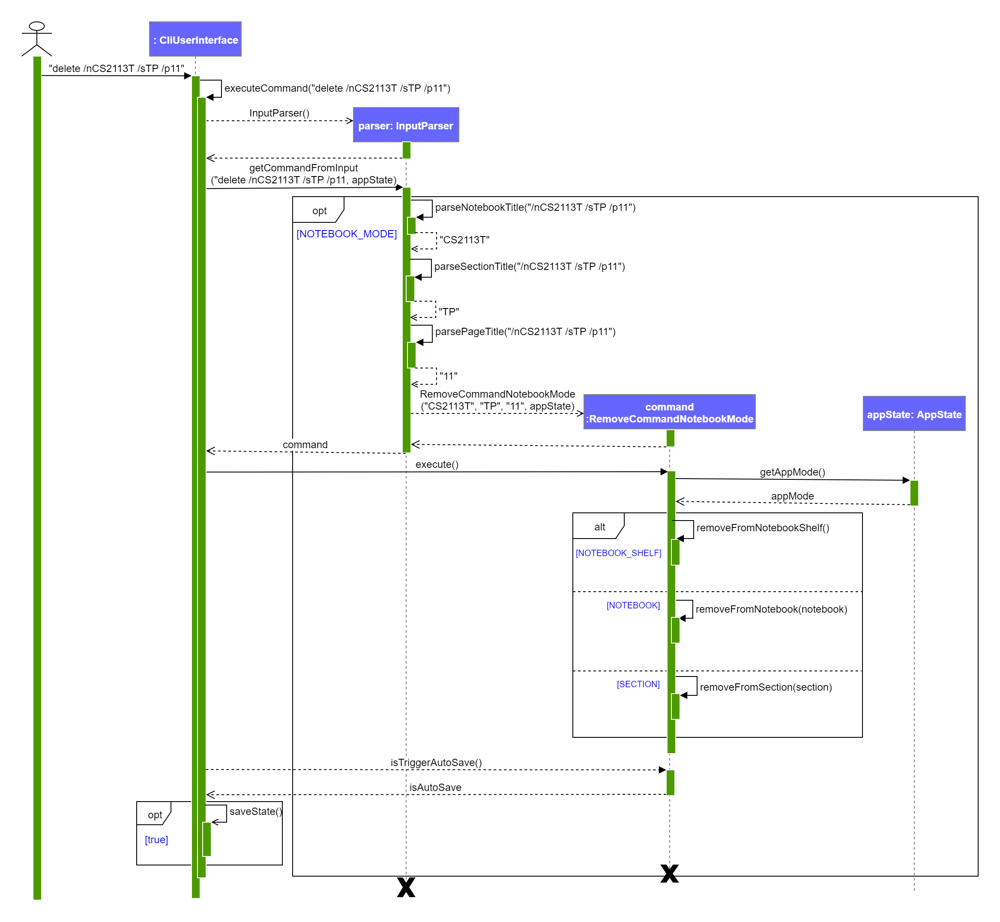
Figure [15]. Sequence diagram for Delete Command in Notebook Mode

The sequence diagram above depicts an example where the user wants to delete a page:
1. The `CliUserInterface` receives the "delete /nCS2113T /sTP /p11" input by the user and passes it to the `InputParser`
class.
2. `InputParser#getCommandFromInput` parses the input to return the notebook title "CS2113T", section title "TP", and the page title "11".
3. `InputParser#getCommandFromInput` then constructs the `RemoveCommandNotebookMode` class and returns it to
 `CliUserInterface`.
4. `RemoveCommandNotebookMode#execute()` is called to delete the page.
    a. If the user is in a bookshelf, `execute()` calls `removeFromNotebookshelf()`.
    b. If the user is in a notebook, `execute()` calls `removeFromNotebook(Notebook)`.
    c. If the user is in a section, `execute()` calls `removeFromSection(Section)`.
5. `CliUserInterface#IsTriggerAutosave` is called to verify whether a change has been made in the NotebookShelf.

#### 4.3.2. Select Feature

The user can `select` a `Notebook`, `Section` or `Page` to view its contents. This section describes the implementation and design considerations for this feature.

**Implementation**

Given below is an example usage scenario and how the select notebook function behaves.

1. `CliUserInterface#executeCommand` is called when the user selects a `Notebook` from the `NotebookShelf`.

2. The user types `select /nCS2113T`. The `select` command is passed through `InputParser#getCommandFromInput`.

3. `InputParser#getCommandFromInput` returns the command `SelectCommandNotebookMode`.

4. A constructor for `SelectCommandNotebookMode` is created.

5. `SelectCommandNotebookMode#execute()` runs, which then calls `InputParser#extractParams`.

6. If the argument typed by the user contains `/n`, which is the Notebook delimitter, `InputParser#extractNotebookParams` is called.

7. Within `InputParser#extractNotebookParams`, `AppState#setAppMode` is called to set the `AppMode` as `NOTEBOOK_BOOK`.

The UML sequence diagram below shows how the select notebook command works.
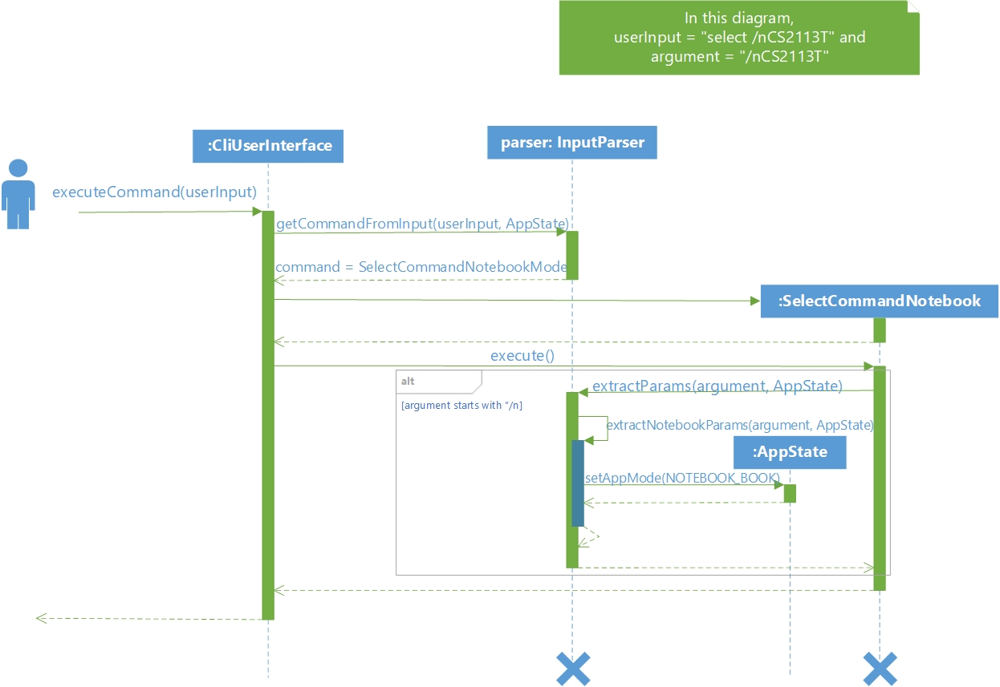
Figure [16]. Sequence diagram for Select Command in Notebook Mode

**Design Considerations**

*Aspect: How much navigability the Select function should have*
- **Alternative 1 (current choice):** The user must always select the notebook title if he wants to choose a section or page within it.
    - Pros: It is easy to catch exceptions when the notebook/section does not exist. This also ensures that even if there are 2 sections in 2 different notebooks with the same name, the user can select the correct section.
    - Cons: The format for the command is longer.
- **Alternative 2**: The user can select a notebook/section/page wherever he wants.
    - Pros: The command the user has to type is much shorter.
    - Cons: If the user has notebooks/sections with the same name, he cannot be sure that the item he wants will be selected correctly.

#### 4.3.3. Tag Feature

The user can add a `tag` to a `Notebook`, `Section` or `Page`. This section describes the implementation and design
considerations for this feature.

**Implementation**
The `Notebook`, `Section` and `Page` classes each contain a member `tag` of type String.

The figure below shows how the tag operation works:

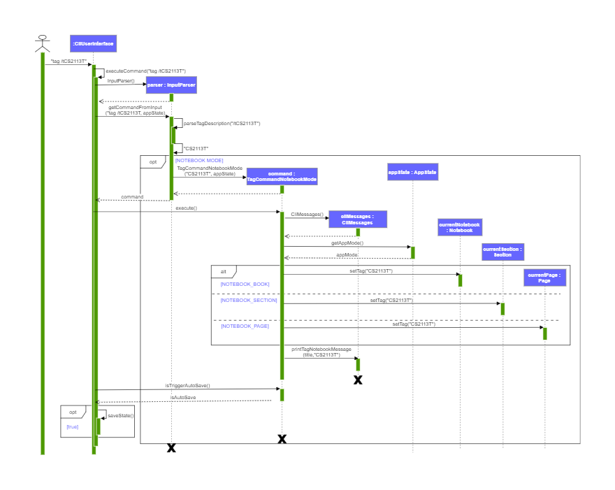
Figure [17]. Sequence diagram for Tag Command in Notebook Mode

When the user enters `tag /tCS2113T` into the command window while using the application:
1. The `CliUserInterface` receives the "tag /tCS2113T" input by the user and passes it to the `InputParser`
class.
2. `CliUserInterface#executeCommand(String argument)` calls `InputParser#getCommandFromInput`.
2. `InputParser#getCommandFromInput` first parses the input to return the tag "CS2113T".
3. `InputParser#getCommandFromInput` then constructs the `TagCommandNotebookMode` class and returns it to
 `CliUserInterface`.
4. `TagCommandNotebookMode#execute()` is called to add a tag to the notebook/section/page the user is in.
5. `CliUserInterface#IsTriggerAutosave` is called to verify whether a change has been made in the NotebookShelf.

**Design Considerations**
This section describes some of the considerations involved when designing the tag feature.

*Aspect: How to store the tags*
- **Alternative 1 (current choice):** Store as a private `String` member in every task
    - Pros: It is easy to access for print operations.
    - Cons: It is unoptimized in terms of complexity for search operations, which requires more work for scaling of the
    application.
- **Alternative 2:** Store as a Hash Table with the key as the tag and value as `Task`
    - Pros: It has a better time complexity for search operations since this data structure is more optimized (O(1) can
    be achieved).
    - Cons: It is hard to retrieve the tag for a specific `Task` due to the structure of the key-value pair.

#### 4.3.4. Search Feature

This feature works similarly to the [search feature](#425-search-feature) in the Timetable mode. Refer to
[Tag Feature](#433-tag-feature) for more information on the implementation of tags in the Notebook mode.

**Implementation**

The following sequence diagram shows how the search feature works in the notebook mode:

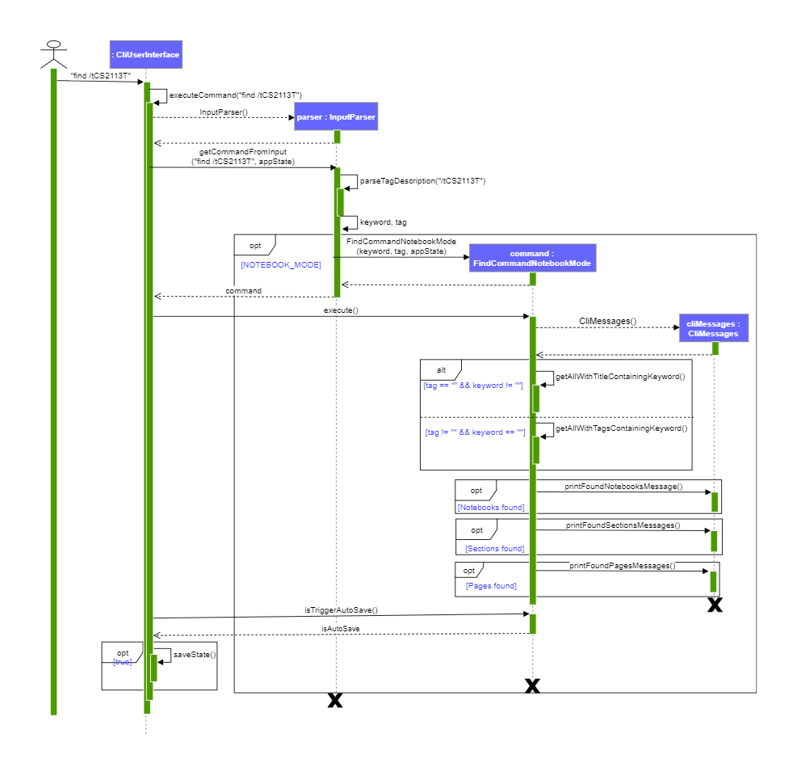
Figure [18]. Sequence diagram for Find Command in Notebook Mode

As the implementation of the search feature in the Notebook mode is similar to that in the Timetable mode, except:
- The `CliMessages` class is constructed in `FindCommandNotebookMode#execute()` to display all the notebooks, sections
and pages found.

**Design Considerations**

*Aspect: Way to search through the notebook shelf*
- **Alternative 1 (current choice):** Loop through every page, section and notebook
    - Pros: Able to trace the notebook and section that a found page belongs to. This makes it more convenient to show
    to the user.
    - Cons: It is unoptimized in terms of complexity, with a complexity of O(n<sup>3</sup>).
- **Alternative 2:** Store all notebooks, sections and pages into respective lists
    - Pros: Has better time complexity of O(n) as it only needs to iterate through each list.
    - Cons: Unable to output the notebook and section that a page belongs to to the user

#### 4.3.5. List Feature

**Implementation**

The following sequence diagram shows how the list operation in the notebook mode works:

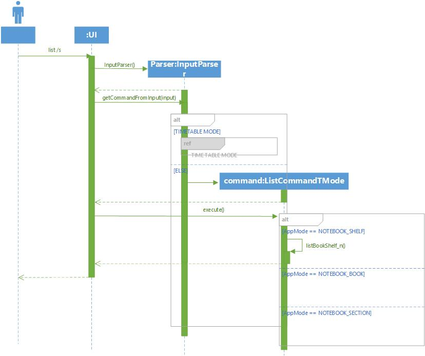
Figure [19]. Sequence diagram for List Command in Notebook Mode

Given below is an example usage scenario and how the list function behaves.

Step 1. The user types `list /s`. The `list /s` command is passed through
`InputParser#getCommandFromInput`, which constructs a `ListCommandNoteMode` object and calls
`ListCommandNotebookMode#execute()`.

Step 2. `execute()` is called, which then calls the print functions based on the `AppMode` field in `AppState`.

Step 3. The program prints the contents corresponding to the input or throw an exception if the command is
invalid.

<!-- @@author neilbaner -->
### 4.4. Storage (Neil)

The `Storage` class reads and writes the application state to and from a text file.

### 4.4.1. Storage format

This section describes the format used to store the TaskList and NotebookShelf from the application state in a plain
text file.

:exclamation: The operating system newline character is used to terminate lines; that is, `\r\n` on Windows and
`\n` on UNIX-based systems.

#### 4.4.1.1. TaskList

For `TaskList`, the format is as follows:

* One line containing an integer `n`, the number of tasks.
* `3n` lines follow, every 3 lines describing one task.
* The first line contains the task title as a String.
* The second line contains the task due date, in the format `dd-MM-yyyy hhmm`.
* The third line contains a value `true` or `false`, indicating whether the task is done. (`true` means done,
`false` means not done.)

#### 4.4.1.2. Page

For a single page, the format is as follows:

* One line containing the title of the page.
* One line containing the content of the page. Newline characters in the content are replaced with the string `"~~~"`.

#### 4.4.1.3. Section

For a single section, the format is as follows:

* One line containing an integer `p`, the number of pages in the section.
* `p` pages are then described, as specified [here](#4412-page).

#### 4.4.1.4. Notebook

For a single notebook, the format is as follows:

* One line containing an integer `s`, the number of sections.
* `s` sections are then described, as specified [here](#4413-section)

#### 4.4.1.5. NotebookShelf

For `NotebookShelf`, the format is as follows:

* One line containing an integer `n`, the number of notebooks.
* `n` notebooks are then described, as specified [here](#4414-notebook).

### 4.4.2 Implementation

`TaskList`, `Task`,`NotebookShelf`, `Notebook`, `Section`, and `page` contain methods called `serialize()`.
These methods return`String` representations of themselves, as specified [here](#441-storage-format).  

The `serialize()` method in `TaskList` calls the `serialize()` methods for every `Task` object within
it and combines their outputs with a `StringBuilder`.

The `serialize()` method in `NotebookShelf` calls the `serialize()` methods for every `Notebook` object within it and
combines their outputs with a `StringBuilder`.

The `serialize()` method in `Notebook` calls the `serialize()` methods for every `Section` object within
it and combines their outputs with a `StringBuilder`.

The `serialize()` method in `Section` calls the `serialize()` methods for every `Page` object within it and
combines their outputs with a `StringBuilder`.

#### 4.4.2.1. Saving the application state

The following sequence diagram describes the operation of the `saveToFile()` operation.

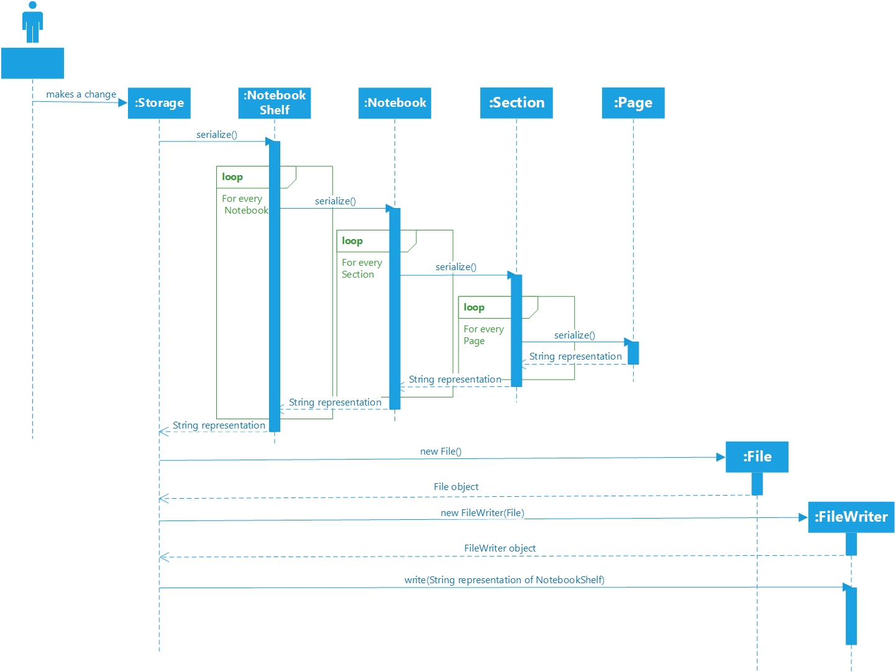
Figure [20]. Sequence diagram for save application method

Note: The diagram above does not show how the `saveToFile()` method saves `Task` objects from the `TaskList`, in
the interest of brevity. The operation of the method is very similar for the `TaskList`, except the hierarchy is much
simpler for tasks (since `Task` objects do not contain other objects).  

The `Storage.saveToFile()` method saves the current application state to a file.

It gets the NotebookShelf and TaskList objects from the current appState, passed in as a parameter. Then, as
described above in the sequence diagram, it iterates through the lists of `Task` objects in the `TaskList` and
`Notebook` objects in the `NotebookShelf`, calling their `serialize()` methods, which in turn call the
`serialize()` methods for each of their contained objects (if applicable). The `saveToFile()` method then uses
`FileWriter`s to write to `File` objects, saving the serialized version of the application state to two text files.

#### 4.4.2.2. Reading the application state

The following sequence diagram describes the operation of the `readFromFile()` operation.

The `Storage.readFromFile()` method creates an instance of `AppState` based on the contents of the saved text files, and
returns said instance of `AppState` if reading the save files was successful, and a blank instance otherwise.

`readFromFile()` uses `Scanner`s, and the `Scanner.nextLine()` method to read the text files line by line. It parses
the lines containing integers indicating the number of notebooks/sections/pages/tasks, and subsequently uses `for`
loops to read the appropriate number of lines.

Each iteration of the loop creates a new instance of `Task`/`Notebook`/`Section`/`Page` as appropriate, using the
constructor to set the fields appropriately based on what is read from the save file, and then it adds the objects
to the appropriate container (i.e. adds each `Task` to the `TaskList`, adds each `Page` to its respective `Section`
etc. ). It then stores the loaded `TaskList` and `NotebookShelf` to a new instance of `AppState` and returns this.

<br>

### 4.5 Error Handling

The `ZeroNoteException` class extends `Exception` by printing an error message to the user when the user encounters an exception.

The following example is a scenario that demonstrates how exceptions are handled in **Zer0Note**.

1. The user launches the application for the first time. `CliUserInterface#executeCommand` is called when the user types in `hello`.

2. The `hello` command is passed through a switch-case block within `InputParser#getCommandFromInput`.

Here is a small snippet of the switch-case block:
``` java
case ModeSwitch.COMMAND_WORD:
    return new ModeSwitch(argument, appState);
default:
    throw new InvalidCommandException(userInput);
```

3. As `hello` is not a command in `Zer0Note`, `InvalidCommandException` which extends `ZeroNoteException` will be thrown.

4. This `ZeroNoteException` is caught by `CliUserInterface#run`, which will then call `ZeroNoteException#printErrorMessage`.

<br>

<!-- @@author yAOwzers-->

### 4.6 Personalised Messages

The `PersonalisedMessageGenerator` class prints out a personalised message to the users after particular commands 
are executed successfully. A personal message is generated by randomising an encouraging message, and is printed 
together with the name entered by the user upon launch of Zer0Note.

The following is an example of how the `PersonalisedMessageGenerator` class is used:  
Assuming that the user has input the username of 'Tom' into Zer0Note.  

1. User adds a task with the given deadline.

2. `execute()` is called, where the boolean method `printsPersonalisedMessage()` in the `CliCommand` class is called.

3. `printsPersonalisedMessage()` returns a boolean variable of the name `PRINTS_PERSONAL_MESSAGE`, which determines whether a personalised message will be printed for the given command. 

4. `printsPersonalisedMessage()` returns true for the `add` command, which calls the `generatePersonalisedMessage()` method in `PersonalMessageGenerator` class. 

5. `generatePersonalisedMessage()` returns a string which contains the random generated personal message to the user.  

<br>

<!-- @@author yAOwzers-->

### 4.7 (Proposed) Save feature for the tagging function

The proposed save feature for the tagging function will be to save the user's respective tags under both tasks and notebooks into the `data` folder. 
The save feature will be included in the Storage class as a `saveTags()` method, similar to the other save features (eg. `saveTask()` method). 
This `saveTags()` method will be included under the `saveToFile()` method.

1. `saveTags()` will get the NotebookShelf and TaskList objects from the current appState, passed in as a parameter. 

2. After which, it iterates through the lists of `Task` objects in the `TaskList` and `Notebook` objects in the `NotebookShelf`, 
calling each of their `serialize()` methods, which in turn calls the `serialize()` methods for each of their contained objects (if applicable). 

3. The `saveToFile()` method then uses `FileWriter`s to write to `File` objects, saving the serialized version of the application state to two text files.

<br>
<hr>
<hr>

<!-- @@author neilbaner -->

## 5. Documentation

The following section describes how documentation for the project should be written. Note: documentation is all
 written in [GitHub-Flavoured Markdown](https://github.github.com/gfm/).

### 5.1. Setting up and maintaining the project website.
- We use **Jekyll** to manage documentation.
- The `docs/` folder is used for documentation.
- To learn how to set it up and maintain the project website, follow the guide
[[se-edu/guides] Using Jekyll for project documentation](https://se-education.org/guides/tutorials/jekyll.html).

### 5.2. Style guidance
- Follow the [Google developer documentation style guide](https://developers.google.com/style).
- Also relevant is the [[se-edu/guides] Markdown coding standard](https://se-education.org/guides/conventions/markdown.html).

### 5.3. Diagrams

We use Microsoft Visio Professional 2019 to draw our UML diagrams. If you do not have access to this software, free
alternatives such as [Lucidchart](https://www.lucidchart.com/pages/), [Google Drawings](https://docs.google.com/drawings),
[LibreOffice Draw](https://www.libreoffice.org/discover/draw/) and many others are also available. If you wish to
contribute diagrams (which we recommend you do if you contribute new features!), you may use any software of your
choosing to draw the diagrams, as long as the finished product somewhat resembles those we already have and follows
UML syntax strictly.

### 5.4. Converting a document to the PDF Format

We use **Chrome** for converting documentation to PDF format.
> Reason: Chrome's PDF engine preserves hyperlinks used in Web pages.

Here are the steps to convert the project documentation files to PDF format.
1. Go to your generated documentation site on GitHub using Chrome.
2. Within Chrome, click on the `Print` option in Chrome’s menu.
3. Set the destination to `Save as PDF`, then click `Save` to save a copy of the file in PDF format.
For best results, use the settings indicated in the screenshot below.


<br>
<hr>
<hr>

## 6. Testing

The following section describes the testing methodologies followed in this project to ensure high-quality, bug-free
code as far as possible.

### 6.1. Running tests

There are two ways to run tests.
- **Method 1: Using IntelliJ JUnit test runner**
    - To run all tests, right-click on the `src/test/java` and choose `Run 'Tests in tp.test'`
    - To run a subset of tests, you can right-click on a test package, test class, or a test and choose `Run 'ABC'`.
- **Method 2: Using Gradle**
    - Open a console and run the command `gradlew clean test` (Mac/Linux: `./gradlew clean test`)

### 6.2. Types of tests
{Describe the type of testing used in the code}

This project has one type of test:
Unit tests targeting the lowest level methods/classes.
e.g. `teetwelvedashthree.zeronote.userinterface.command.notebook.AddNotebookTest`

<br>
<hr>
<hr>

## Appendix A: Project Scope

**Target user profile**
- student with multiple courses
- has a need to multiple notes
- has a need to view upcoming tasks swiftly
- prefer desktop apps over other forms
- is reasonably comfortable using CLI apps

**Value proposition**:<br>
manage both tasks and notes faster and lighter than a typical mouse/GUI driven app

<br>
<hr>
<hr>

## Appendix B: User Stories

Priorities: High (must have) - `***`, Medium (nice to have) - `**`, Low (unlikely to have) - `*`

|Priority| As a ... | I want to ... | So that I can ...|
|--------|----------|---------------|------------------|
|`***`|user|record and save my notes|review them later|
|`***`|student|view all tasks and sections of my notebook|have a clear view of my progress|
|`***`|new user|have usage instructions|refer to instructions when I forget how to use the App|
|`**`|forgetful user|see the most urgent tasks|prioritise my tasks|
|`*`|long-time user|have personalised messages|feel attached to my notes|

<br>
<hr>
<hr>

## Appendix C: Use Cases

(For all use cases below, the System is the `Zer0Note` and the Actor is the `user`, unless specified otherwise)

### Use case: Delete task

1. User requests to list tasks
2. Zer0Note shows a list of tasks
3. User requests to delete a specific task in the list
4. Zer0Note deletes the task  
    Use case ends.

#### Extensions

* 2.1. The task list is empty.  
  Use case ends.  
* 3.1. The given index is invalid.  
   * 3.1.1 Zer0Note shows an error message.  
        Use case resumes at step 2.

/* work in progress */

<br>
<hr>
<hr>

## Appendix D: Non-Functional Requirements

1. Should work on any *mainstream OS* as long as it has Java `11` or above installed.
2. Should be able to hold up to 1000 persons without a noticeable sluggishness in performance for typical usage.
3. A user with above average typing speed for regular English text (i.e. not code, not system admin commands) should be able to accomplish most of the tasks faster using commands than using the mouse.

<br>
<hr>
<hr>

## Appendix E: Glossary

* **Mainstream OS**: Windows, Linux, macOS
* **Notebook shelf**: a list of all notebooks entered by the user

<br>
<hr>
<hr>

<!-- @@author yAOwzers-->

## Appendix F: Instructions for manual testing

Given below are instructions to test the app manually.
>**Note**: These instructions only provide a starting point for testers to work on;
>testers are expected to do more *exploratory* testing.

{Give instructions on how to do a manual product testing e.g., how to load sample data to be used for testing}

### 1. Launch and Shutdown
1.1 Initial launch  
i. Download the jar file and copy into an empty folder.  
ii. Double-click the jar file  
Expected: Command Line Interface should launch with a welcome message from Zer0Note as shown below:  

```
Welcome to
 _ _ _                  _ _ _   _    _            _
|_ _  |   _ _    _  _  |  _  | |  \ | |   _ _   _| |_    _ _
  /  /  /  _  \ | |/_\ | | | | |   \| |  /   \ |_   _| /   _ \
 /  /_  |  _ _/ | |    | |_| | |  |\  | |  [] |  | |_  |  _ _/
|_ _ _|  \ _ _| |_|    |_ _ _| | _| \_|  \ _ /   |_ _|  \ _ _|
You are now in timetable mode
```


### 2. Test Cases

#### 2.1 Deleting a task
2.1.1. Deleting a task while all tasks in the existing tasklist is listed.  
i. Prerequisites: User must be in the Timetable mode. Enter `mode /t` command to enter Timetable mode. List all tasks in the tasklist using the `list` command. There must be existing tasks in the list.  
ii. Test case: `delete 1`    
Expected: First task is deleted from the tasklist.  
iii. Test case: `delete 0`  
Expected: No task is deleted. Error message will be printed in the command line interface.  
iv. Other incorrect delete commands to try: `delete`, `delete x` (where x is larger than the number of tasks in the tasklist)  
Expected: No task is deleted. Error message will be printed in the command line interface.

#### 2.2 Adding a task

2.2.1 Adding a task to the tasklist.  
i. Prerequisites: User must be in the Timetable mode. Enter `mode /t` command to enter Timetable mode.  
ii. Test case: `add /t test task /by 10-10-2020 2000`  
Expected: Task is added into the tasklist with a success message printed.  
iii. Test case: `add /t test task`  
Expected: An error messsage will be printed in the command line interface.  
iv. Test case: `add`  
Expected: An error message along with a formatting guideline message will be printed.  
v. Test case: `add /t test task /by 2020-10-10 2000`  
Expected: An error message along with a formatting guideline message (date format should be dd-MM-yyyy HHmm) will be printed in the command line interface.

#### 2.3 Marking a task as done

2.3.1 Marking a task as done while there are existing task in the tasklist.  
i. Prerequisites: User must be in the Timetable mode. Enter `mode /t` command to enter Timetable mode. List all tasks in the tasklist using the `list` command. There must be existing tasks in the list.  
ii. Test case: `done 1`  
Expected: First task should be marked as done in the tasklist.  
iii. Test case: `done 0`  
Expected: An error messsage along with a formatting guideline message will be printed in the command line interface.  
iv. Other incorrect done commands to try: `done`, `done x` (where x is larger than the number of tasks in the tasklist)  
Expected: An error messsage along with a formatting guideline message will be printed in the command line interface.  

#### 2.4 Tagging a Task

2.4.1. Tagging an existing task in the tasklist.  
i. Prerequisites: User must be in the Timetable mode. Enter `mode /t` command to enter Timetable mode. List all tasks in the tasklist using the `list` command. There must be existing tasks in the list.  
ii. Test case: `tag 1 /tschoolWork`  
Expected: Task in index 1 of the tasklist is tagged with a tag 'schoolWork'.  
iii. Test case: `tag 1`  
Expected: An error message along with a formatting guideline message will be printed in the command line interface.  
iv. Test case: `tag`  
Expected: An error message along with a formatting guideline message will be printed in the command line interface.  
v. Test case: `tag schoolWork`  
Expected: An error message along with a formatting guideline message will be printed in the command line interface.

#### 2.5 Listing a Task

2.5.1. Listing existing task in the tasklist.  
i. Prerequisites: User must be in the Timetable mode. Enter `mode /t` command to enter Timetable mode. There must be existing tasks in the list.

2.5.1.1. Listing all existing task in the tasklist.  
i. Test case: `list`  
Expected: All existing tasks in the tasklist will be printed out.

2.5.1.2. Listing all marked as done existing tasks in the tasklist.  
i. Test case: `list /d`  
Expected: All existing marked as done tasks in the tasklist will be printed out.  

2.5.1.3. Listing all undone existing tasks in the tasklist.  
i. Test case: `list /u`  
Expected: All existing undone tasks in the tasklist will be printed out.  

2.5.1.4. Listing all urgent existing tasks in the tasklist.  
i. Test case: `list /urgent`  
Expected: All existing urgent tasks in the tasklist will be printed out.  

#### 2.6 Executing a mode switch

2.6.1. Switching between Timetable mode and Notebook mode.  
i. Prerequisites: User must be in the Timetable mode. Enter `mode /t` command to enter Timetable mode.  
ii. Test case: `mode /n`   
Expected: Mode is switched to Notebook mode.  
iii. Test case: `mode /t`  
Expected: Mode is switched to Timetable mode.  
iv. Test case: `mode`  
Expected: An error message along with a formatting guideline message (missing follow up command '/n' or '/t') will be printed in the command line interface..  

#### 2.7 Finding a Task using a keyword

2.7.1. Finding all tasks that contains a specified keyword.  
i. Prerequisites: User must be in the Timetable mode. Enter `mode /t` command to enter Timetable mode. List all tasks in the tasklist using the `list` command. There must be existing tasks in the list.  
ii. Test case: `Find Project`  
Expected: All tasks with tags that contains the word 'Project' will be printed. If the tasks do not have tags, it will list the tasks with titles that contain the keyword 'Project'.  
iii. Test case: `Find`  
Expected: An error message along with a formatting guideline message will be printed in the command line interface.  

#### 2.8 Adding a Notebook/Section/Page

2.8.1. Adding a respective notebook/section/page in their respective list.  
i. Prerequisites: User must be in the Notebook mode. Enter `mode /n` command to enter Notebook mode.    

2.8.1.1. Adding a Notebook.  
i. Prerequisites: User must not be in a selected notebook or section. User should type `mode /n` before executing this test case.   
ii. Test case: `add /nCS2113T`  
Expected: Notebook 'CS2113T' is added to the notebookShelf with a success message printed.  

2.8.1.2. Adding a Section.  
i. Prerequisites: User must select a notebook. Enter `select /n[NOTEBOOK]` to enter a specified notebook.    
ii. Test case: `add /sChapter 1`  
Expected: Section 'Chapter 1' is added to the specified notebook with a success message printed.  

2.8.1.3. Adding a Page.  
i. Prerequisites: User must select a Section. Enter `select /s[SECTION]` to enter a specified section.    
ii. Test case: `add /pPage 1 ; a test page`  
Expected: Page 'Page 1' along with content 'a test page' is added to the specified section with a success message printed.  

#### 2.9 Selecting a Notebook/Section/Page

2.9.1. Selecting a respective notebook/section/page in their respective list.  
i. Prerequisites: User must be in the Notebook mode. Enter `mode /n` command to enter Notebook mode.  

2.9.1.1. Selecting a Notebook.    
i. Test case: `select /nCS2113T`  
Expected: The user will enter the selected notebook 'CS2113T' with a success message printed.

2.9.1.2. Selecting a Section.  
i. Test case: `select /sChapter 1`  
Expected: The user will enter the selected Section 'Chapter 1' with a success message printed.

2.9.1.3. Selecting a Page.  
i. Test case: `select /pPage 1`  
Expected: The user will enter the selected Page 'Page 1' with a success message printed.  
ii. Test case: `select /nCS2113T /sChapter 1 /pPage 1`  
Expected: The user will enter the selected Page 'Page 1' with a success message printed.  

#### 2.10 Deleting a Notebook/Section/Page

2.10.1. Deleting a respective notebook/section/page in their respective list.  
i. Prerequisites: User must be in the Notebook mode. Enter `mode /n` command to enter Notebook mode. There must be existing notebooks/sections/pages in the respective list when command `list` is entered.  

2.10.1.1. Deleting a notebook.  
i. Test case: `delete /nCS2113T`    
Expected: The selected notebook 'CS2113T' will be deleted, along with the sections and pages under it, with a success message printed.

2.10.1.2. Deleting a section.  
i. Test case: `delete /sChapter 1`    
Expected: The selected section 'Chapter 1' will be deleted, along with the pages under it, with a success message printed.

2.10.1.3. Deleting a notebook.  
i. Test case: `delete /pPage 1`    
Expected: The selected page 'Page 1' will be deleted with a success message printed.

#### 2.11 Listing a Notebook/Section/Page

2.11.1 Listing existing notebook/section/page in the NotebookShelf.  
i. Prerequisites: User must be in the Notebook mode. Enter `mode /n` command to enter Notebook mode. There must be existing notebooks/sections/pages in the respective list when command `list` is entered.  
ii. Test case: `list`   
Expected: All existing Notebooks/Sections/Pages will be listed in the given NotebookShelf/Notebook/Section respectively.  

2.11.1.1. Listing all n task in the tasklist.  
i. Test case: `list /a`  
Expected: All notebooks, sections and pages will be printed out.  

2.11.1.2. Listing the list of notebooks and their sections   
i. Prerequisites: User must be in a notebook and not in a section.  
ii. Test case: `list /s`  
Expected: All notebooks and their respective sections will be printed out.  

#### 2.12 Tagging a Notebook/Section/Page

2.12.1. Tagging an existing notebooks/sections/pages in the list.  
i. Prerequisites: User must be in the Notebook mode. Enter `mode /n` command to enter Notebook mode. List all tasks in the tasklist using the `list` command. There must be existing tasks in the list.  
ii. Test case: `tag /tschoolWork`  
Expected: Specified name of notebook/section/page in the list is tagged with a tag 'schoolWork'.  
iii. Test case: `tag`  
Expected: An error message along with a formatting guideline message will be printed in the command line interface.   

#### 2.13 Finding a Notebook/Section/Page using a keyword

2.13.1. Finding all notebooks/sections/pages that contains a specified keyword.  
i. Prerequisites: User must be in the Notebook mode. Enter `mode /n` command to enter Notebook mode. List all notebooks/sections/pages in the notebookShelf using the `list /a` command. There must be existing notebooks/sections/pages in the list.  
ii. Test case: `Find Project`  
Expected: All notebooks/sections/pages with tags that contains the word 'Project' will be printed. If the notebooks/sections/pages do not have tags, it will list the notebooks/sections/pages with titles that contain the keyword 'Project'.  
iii. Test case: `Find`   
Expected: An error message along with a formatting guideline message will be printed in the command line interface.  

### 3. Saving Data

3.1. Dealing with corrupted data files  
i. Click on the folder that the jar file had been saved in.  
ii. Select both the 'tasks.txt' and 'notebooks.txt'.
iii. Delete both files.  
iv. Restart the application by double-clicking the jar file and running Zer0Note.  
Expected: The Command Line Interface should launch with a welcome note from Zer0Note as shown in Appendix F, 1.1.

3.2 Dealing with corrupted name file  
i. Click on the folder that the jar file had been saved in.  
ii. Enter the 'src', then 'main', 'resources' and then 'txt' folder.  
iii. Delete the file named 'nameOfUser.txt'  
iv. Restart the application by double-clicking the jar file. Re-enter the name of user.  

3.3 Changing of saved name  
i. Click on the folder that the jar file had been saved in.  
ii. Enter the 'src', then 'main', 'resources' and then 'txt' folder.  
iii. Double-click the 'nameOfUser.txt' file to edit it.  
iv. Change the name in the txt file with the desired name and save the file.  
v. Re-run Zer0Note with the desired name.  
